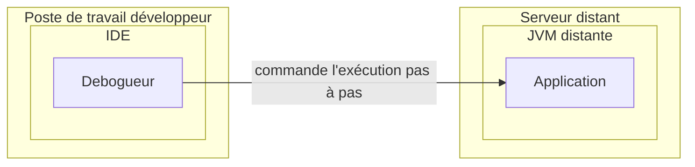

# Débogage d'une JVM distante avec IntelliJ _via_ un tunnel SSH

Ce billet présente une experimentation d'exécution en debug d'une application java tournant sur une VM distante à l'aide d'un tunnel SSH.

## _<<Débogage d'une JVM distante>>_ : de quoi parle-t-on ?

Lorsqu'une application dysfonctionne (erreur explicite ou résultat inattendu), on peut utiliser plusieurs outils ou méthodes
pour comprendre ce qui ne va pas et modifier le code en conséquence :
- lire les logs
- exécuter /écrire des tests spécifiques
- consulter des rapports d'observabilité
- regarder les données en base, dans les fichiers, ...
- exécuter en debug

L'exécution en debug d'une application est bien connu sur le poste du développeur pour exécuter le code pas à pas et comprendre
ce qui ne va pas quand les autres outils n'ont pas permis de fournir une explication. Ceci dit, cela arrive parfois avec
java, l'application ne se comporte pas de la même manière sur tous les environnements, toutes choses égales par ailleurs. Ca 
a par exemple été le cas avec l'encodage par défaut jusqu'en java 18(JEP 400). On peut donc se retrouver à chercher la cause
d'un dysfonctionnement qui ne produit que sur un environnement distant donné : comment alors exécuter en debug (pas à pas)
depui l'IDE sur notre poste l'application qui tourne sur une JVM sur un serveur distant ?

Ce qui se résume par le schéma suivant :

## Pourquoi un tunnel SSH ?

- 

## Mise en œuvre sur un exemple

### Application test

### Vérification en local

### Déploiement de l'application sur le serveur distant

### Création de la "configuration de débogage dans IntelliJ"

### Lancement de l'application sur le serveur distant

### Création du tunnel SSH

### Lancement du débogueur dans Intellij

### Ca marche !

### Arrêter dans l'ordre

## Sur kubernetes

Si l'application est déployée dans un cluster kubernetes, on utilisera le [_port forwarding_](https://kubernetes.io/docs/reference/generated/kubectl/kubectl-commands#port-forward) 
plutôt que le _tunneling SSH_.
Si l'outil [telepresence](https://www.getambassador.io/products/telepresence) est présent sur le cluster,
[Intellij s'intègre aussi avec](https://www.jetbrains.com/help/idea/telepresence.html).

## Alternatives au débogage distant

- Utiliser un enregistrement [_JDK Flight Recorder_](https://dev.java/learn/jvm/jfr/intro/) pour observer ce qui se passe 
sur une JVM distante (il n'est pas nécessaire de la redémarrer). 

## Références

- [Le tunneling SSH sur le blog de Stéphane Robert](https://blog.stephane-robert.info/docs/admin-serveurs/linux/ssh-tunneling/)
- [Débogage distant avec Intellij](https://www.jetbrains.com/help/idea/tutorial-remote-debug.html)
- [Débogage en java pour débuter](https://dev.java/learn/debugging/)
- [_Java Platform Debugger Architecture (JPDA)_](https://docs.oracle.com/en/java/javase/21/docs/specs/jpda/architecture.html)