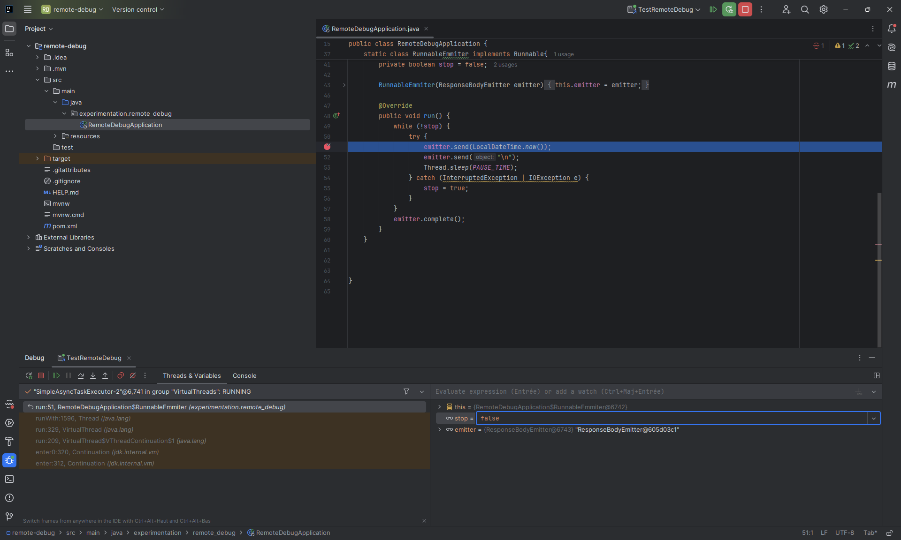

# Débogage d'une JVM distante avec IntelliJ _via_ un tunnel SSH

Ce billet présente une experimentation d'exécution en debug d'une application java tournant sur une VM distante à l'aide d'un tunnel SSH.

## _<<Débogage d'une JVM distante>>_ : de quoi parle-t-on ?

Lorsqu'une application dysfonctionne (erreur explicite ou résultat inattendu), on peut utiliser plusieurs outils ou méthodes
pour comprendre ce qui ne va pas et modifier le code en conséquence :
- lire les logs
- exécuter /écrire des tests spécifiques
- consulter des rapports d'observabilité ou effectuer un enregistrement [_JDK Flight Recorder_](https://dev.java/learn/jvm/jfr/intro/)
- regarder les données en base, dans les fichiers, ...
- exécuter en debug

L'exécution en debug d'une application est bien connu sur le poste du développeur pour exécuter le code pas à pas et comprendre
ce qui ne va pas quand les autres outils n'ont pas permis de fournir une explication. Ceci dit, cela arrive parfois avec
java, l'application ne se comporte pas de la même manière sur tous les environnements, toutes choses égales par ailleurs. Ça 
a par exemple été [le cas avec l'encodage par défaut jusqu'en java 18](https://openjdk.org/jeps/400). On peut donc se retrouver à chercher la cause
d'un dysfonctionnement qui ne produit que sur un environnement distant donné : comment alors exécuter en debug (pas à pas)
depui l'IDE sur notre poste l'application qui tourne sur une JVM sur un serveur distant ?

Ce qui se résume par le schéma suivant :


## Pourquoi un tunnel SSH ?

La communication entre le Debogueur dans l'IDE et la JVM distante qui héberge l'application se fait via des échanges réseau 
TCP. Le port d'écoute de la JVM est paramétrable dans la commande de lancement de l'application (cf. plus bas). Le port utilisé 
par le débogueur de l'IDE est choisi aléatoirement pas ce dernier.

Si le débogueur de l'IDE arrive directement à joindre la VM distant sur le port paramétré (en suivant le tutoriel jetBrains
figurant dans [les références ci-dessous](#références)), c'est que les ports nécessaires sont ouverts et il n'est pas nécessaire 
de suivre plus loin ce tutoriel, sauf si le contexte réseau n'est pas sûr (cf. [Précautions](#précautions)).

Si en revanche, comme dans beaucoup d'entreprises, seuls certains ports (déjà utilisés) sont ouverts sur les machines, le débogage 
à distance ne fonctionnera pas directement et il sera nécessaire de passer par un tunnel SSH pour les communications entre le 
débogueur et la JVM distante. C'est l'objet de ce qui suit.

## Architecture avec le tunnel SSH

Ici c'est [un tunnel SSH avec redirection de port local](https://blog.stephane-robert.info/docs/admin-serveurs/linux/ssh-tunneling/#redirection-de-port-local) qui sera utilisé.
Ce tunnel permettra d'encapsuler le traffic réseau TCP entre le débogueur de l'IDE et la JVM distante au sein des communications SSH entre les deux machines (puisqu'ici on
suppose qu'elles sont premises). En pratique, le port sur lequel la JVM écoute les instructions du débogueur apparaîtra comme un port
local de la machine et sera utilisé en tant que tel par le débogueur de l'IDE

## Mise en œuvre sur un exemple

Dans l'exemple qui suit, l'utilisateur `fabrice` souhaite déboguer à distance depuis son IDE IntelliJ une [application java](#application-test) qui
tourne sur une machine distante identifiée par son IP `192.168.0.82`. La JVM écoutera les instructions du débogueur sur le port 5005 qui sera
"relié par le tunnel SSH" au port 50005 de la machine locale.


### Prérequis

- l'utlisateur `fabrice` doit pouvoir effectuer une connexion ssh sur la machine `192.168.0.82` : `ssh fabrice@192.168.0.82`
- sur la machine distante, l'utilisateur doit pouvoir relancer l'application test java en modifiant sa ligne de commande

### Application test

L'application Test est une simple application java web qui s'appuie sur Spring Boot qui tient en [une classe](./src/main/java/experimentation/remotedebug/RemoteDebugApplication.java)
et en [une dépendance](./pom.xml).

Elle expose un seul endpoint `GET /test` accessible par tous et qui sert indéfiniment des timestamps au client jusqu'à ce que l'application soit
arrêté ou que le processus soit interrompu (permet de vérifier qu'on arrive bien à modifier la valeur du bouléen par le débogueur à distance).

### Vérification en local

Il s'agit de lancer l'application en local (celle-ci aura le même comportement en local qu'à distance) en mode debug dans l'IDE et de mettre un point
d'arrêt à la ligne 51 sur `emitter.send(LocalDateTime.now());`. Par défaut l'application écoute sur le port 8080, on peut donc déclencher l'affichage 
des timestamps en appelant `GET http://localhost:8080/test` avec un client type curl. La vue de débogage se met en place et l'exécution se bloque sur
le point d'arrêt


On vérifie que le pas à pas fonctionne et qu'on tourne infiniment dans la boucle en faisant _Step over_ tandis que côté client on reçoit un nouveau
timsestamp à chaque itération. On peut vérifier également qu'on modifiant la valeur du bouléen `stop` en la passant à `true` via le débogueur puis
en reprenant l'exécution, le programme quitte la boucle et la réponse http est clôturée.

### Déploiement de l'application sur le serveur distant

L'application sera exécutée en tant que _fat jar_ exécutable : ce jar est produit automatiquement par maven ou gradle lors du build de l'exécution de
la phase _package_ (resp. la tâche _bootJar_). C'est ce jar qui doit être déposé sur la VM distante `192.168.0.82` pour y être exécuté.

### Création de la "configuration de débogage dans IntelliJ"

Du point de vue du débogueur Intellij, l'application distante sera exécutée sur `localhost` et la JVM écoutera les instructions du débogueur
sur le port 50005. On configure l'exécution "Remote JVM Debug" à cet effet :
- Dans Intellij, ouvrir la fenêtre avec les configurations d'exécution (Menu -> Run -> Edit configurations ...)
- Créer une nouvelle configuration de type _Remote JVM Debug_
- Remplir les champs comme suit :
  - Debugger mode : `Attach to remote VM`
  - Host : `localhost`
  - Port : `50005`
  - si le champ "Transport" est présent : renseigner la valeur `Socket`
- Copier le contenu du champ `Command line argmuent for remote JVM` pour l'ajouter à la commande de lancement de l'application
**après modifications** : il sera de la forme`-agentlib:jdwp=transport=dt_socket,server=y,suspend=n,address=*:50005`
il faudra remplacer le numéro du port à la fin par 5005.

### Lancement de l'application sur le serveur distant

Lancer l'application java test sur la machine distante en ajoutant l'option de débogage à la ligne de commande 
**avec le numéro de port 50005 remplacé par 5005** :

```shell
java -agentlib:jdwp=transport=dt_socket,server=y,suspend=n,address=*:5005 -jar /path/to/remote-debug.jar
```

### Création du tunnel SSH

La création d'[un tunnel SSH avec redirection de port local](https://blog.stephane-robert.info/docs/admin-serveurs/linux/ssh-tunneling/#redirection-de-port-local)
entre le port 5005 de la machine distante et le port 50005 du poste de travail se fait en lancant la commande suivante sur le poste de travail :

```shell
ssh -L 50005:127.0.0.1:5005 fabrice@192.168.0.82
```

Une session SSH s'ouvre et le tunnel est créé. La session SSH peut être utilisée et fermée indépendamment du tunnel qui 
restera ouvert tant qu'il y aura des échanges.

### Lancement du débogueur dans Intellij

Lancer la configuration de débogage créée précédemment dans IntelliJ en  la sélectionnant parmi les configurations d'exécution et
en cliquent sur  :
L'IDE se connecte à la JVM distante et la vue de débogage se met en place :


On note que dans la vue de débogage, il est inscrit `Connected to the target VM, address: 'localhost:50005', transport: 'socket'`

### Ca marche !

- Vérifier que le point d'arrêt posé à la ligne 51 est toujours présent
- Effectuer une requête `GET http://localhost:8080/test` avec un client type curl
- l'exécution de l'application distance s'arrête au point d'arrêt et les informations de débogage s'affichent
- On peut faire du pas à pas et observer les timestamp envoyés progressivement par le serveur comme dans [le cas local](#vérification-en-local)
- Modifier la valeur du bouléen `stop` à `true` (clic droit -> _Set value..._ ou F2) et reprendre l'exécution : l'application sort de la boucle et la réponse http est clôturée :

- A l'issue de la session de debogage :
  1. Arrêter le débogueur dans l'IDE en le déconnectant (fermer l'onglet avec la débogage en cours dans la vue de débogage)
  2. Fermer la session ssh si elle est toujours ouverte (`exit`)
  3. Si nécesaire, arrêter l'application distante

## Précautions

- Les échanges réseau entre le débogueur et la JVM distante se font en clair : sans l'utilisation d'un tunnel SSH, des informations confidentielles
peuvent transiter en clair : le tunnel SSH permet de remédier à cela.
- [Quelques bonnes pratiques pour sécuriser un tunnel SSH](https://blog.stephane-robert.info/docs/admin-serveurs/linux/ssh-tunneling/#sécurité-et-bonnes-pratiques)

## Sur kubernetes

Si l'application est déployée dans un cluster kubernetes, on utilisera le [_port forwarding_](https://kubernetes.io/docs/reference/generated/kubectl/kubectl-commands#port-forward) 
plutôt que le _tunneling SSH_.
Si l'outil [telepresence](https://www.getambassador.io/products/telepresence) est présent sur le cluster, [Intellij s'intègre aussi avec](https://www.jetbrains.com/help/idea/telepresence.html) : je n'ai jamais
essayé, je n'ai donc aucune idée de la façon dont ça fonctionne.

## Références

- [Le tunneling SSH sur le blog de Stéphane Robert](https://blog.stephane-robert.info/docs/admin-serveurs/linux/ssh-tunneling/)
- [Débogage distant avec Intellij](https://www.jetbrains.com/help/idea/tutorial-remote-debug.html)
- [Débogage en java pour débuter](https://dev.java/learn/debugging/)
- [_Java Platform Debugger Architecture (JPDA)_](https://docs.oracle.com/en/java/javase/21/docs/specs/jpda/architecture.html)